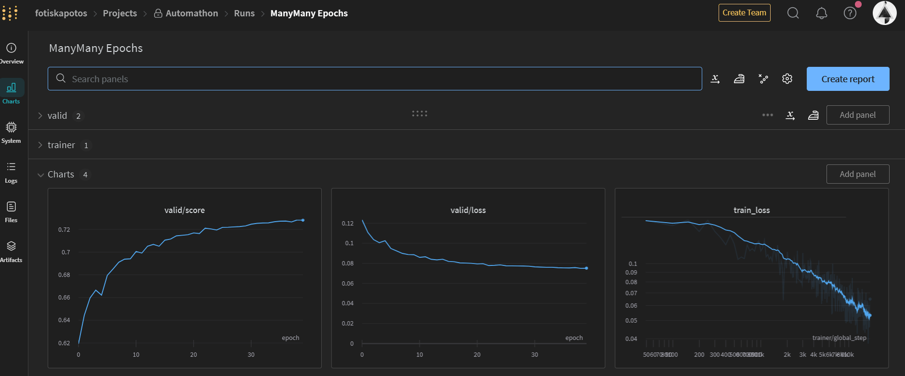

# Automathon 

[](https://stringfixer.com/fr/MIT_license)
[](https://pytorch.org/)
[](https://wandb.ai/site)
[](https://github.com/fotisk07)
[](https://github.com/fotisk07)


Below is my solution for the Automathon Superposed MNIST competition. 

Given an input image of two superimposed digits images from the MNIST dataset, the goal is to reconstruct those two images of the two digits.


## Installation
Install requirements for this repo just by running

```
pip install requirements.txt
```

## Model

The model used is a simple Autoencoder 

  

However, some tricks are being used to increase performance. 

The first thing to do is to use a custom loss function that takes into account the symmetry of the two images. In addition, the model only has to predict one image, since the other can simply be obtained by substracting the predicted one from the input one.


## Training 

I used the [cliconfig package](https://github.com/valentingol/cliconfig) by [valentingol](https://github.com/valentingol?tab=repositories) to keep track of my configurations. 

I also used Weights and Biases to keep track of my training metrics.

  


 
